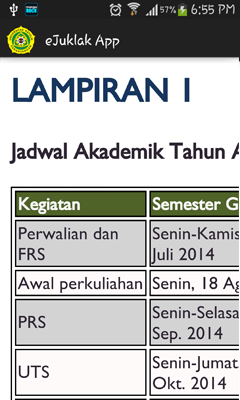
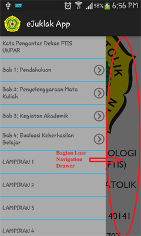

# Penjelasan Cara Menggunakan Aplikasi

Berikut adalah petunjuk penjelasan cara menggunakan aplikasi eJuklak.

1. Install **eJuklak App.apk** terlebih dahulu.
2. Setelah selesai, jalankan aplikasi dengan cara menekan logo aplikasi.
  
  

3. Setelah program dijalankan, akan muncul tampilan awal aplikasi.

  

  

4. Aplikasi mendukung fitur *scroll* dan fitur *zoom* sehingga Anda dapat melakukan *scroll up* atau *down* serta *zoom in* dan *zoom out*.

  

  

5. Aplikasi memiliki fitur *navigation drawer*. Untuk membukanya, letakkan jari (1 saja) di sisi kiri layar dan geser jari ke arah kanan sampai *navigation drawer* terbuka atau cukup tekan logo aplikasi di pojok kiri atas.  

  

6. Untuk berpindah halaman menggunakan *navigation drawer*, tekan bagian yang ingin kita tuju. Penekanan ini akan membuat tampilan berpindah ke bagian tersebut.
  - Apabila bagian tersebut masih memiliki bagian dalam (tingkat 2), seperti subbab untuk bab, maka *navigation drawer* akan membuka bagian dalam tersebut. 
  - Apabila tidak, maka *navigation drawer* akan tertutup. Pembukaan *navigation drawer* selanjutnya akan menampilkan bagian terakhir sebelum *navigation drawer* tersebut tertutup.

  

  

7. *Navigation drawer* dapat ditutup dengan menekan bagian luar *navigation drawer* atau dengan menekan tombol *back* pada *device* (bukan pada layar; untuk posisi *navigation drawer* di tingkat 1). Tombol *back* pada *device* juga dapat digunakan untuk mengembalikan tampilan *navigation drawer* ke tingkat 1 apabila *navigation drawer* berada di tingkat 2 atau lebih.

  

8. Untuk menutup aplikasi, tutup *navigation drawer* lalu, tekan tombol *back* pada *device* sampai muncul “Press back again to leave” pada layar, kemudian tekan *back* sekali lagi sebelum tulisan tersebut hilang. Ini akan menutup aplikasi, dan pembukaan aplikasi selanjutnya akan menampilkan halaman awal aplikasi seperti pada nomor 3.

  