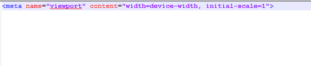
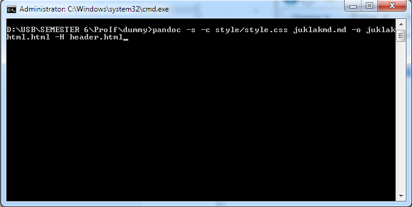
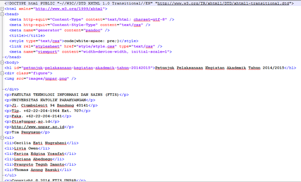

# Penjelasan Cara Membangun Aplikasi dari Source Code yang Ada di Repository


## Konversi HTML

Proses mengkonversi dokumen menjadi HTML dapat dilakukan dengan menggunakan Pandoc. Proses mengkonversi *file* pada Pandoc menggunakan perintah pada CMD. Untuk dokumentasi lengkap penggunaan Pandoc dapat dilihat melalui website [Pandoc](http://pandoc.org/).  

Langkah-langkah mengkonversi *file* Markdown ke HTML:  

1. Pertama masuk terlebih dahulu ke dalam direktori tempat *file* Markdown yang akan dikonversi disimpan.
2. Akses *file* **header.html** yang tersedia di repositori res kemudian simpan *file* **header.html** ke direktori tempat *file* Markdown tersimpan.

  
3. Langkah selanjutnya adalah melakukan konversi terhadap *file* Markdown tersebut. Perintah yang digunakan adalah sebagai berikut.  

   ```
    pandoc -s -c CSS MARKDOWN -o HTML -H HEADER
   ```
  Contoh perintah:

    
  Perintah tersebut akan menerima *file input* berupa Markdown dengan nama **juklakmd.md** dan *file* CSS yang tersimpan di *folder* **style** dengan nama **style.css** dengan tambahan *header* dari **header.html** kemudian menghasilkan *file output* HTML dengan nama **juklakhtml.html**.

  


##Pembuatan Aplikasi

Bagian ini akan menjelaskan cara membuat aplikasi dari source code yang ada di repositori eJuklak. 
Berikut adalah langkah-langkahnya:

1. Unduh semua *file* yang tersedia di repositori **eJuklak App**.
2. Buka aplikasi IDE untuk membuat aplikasi Android. Pada cara pembuatan ini digunakan aplikasi **Eclipse LUNA**.
3. Buka menu File lalu pilih **Import project**. Lakukan *import* dari *file* yang telah didapat di langkah 1.
4. Klik kanan pada *project* lalu pilih menu **Run As** kemudian pilih **Android Application**.
5. Setelah *run project* berhasil dilakukan, APK akan terbentuk secara otomatis di folder **bin**.
5. Pembentukan APK dapat pula dilakukan dengan cara export. Buka menu **File** dan klik menu **Export**.
6. Pilih *folder* Android lalu klik **Export Android Application**.
7. Pilih *project* **EJuklak App** dan klik **Next**.
8. Langkah berikutnya adalah pembuatan *keystore*. Anda dapat membuat *keystore* baru atau memilih *keystore* yang sudah tersedia.
9. Klik **Finish** dan APK sudah terbentuk.

