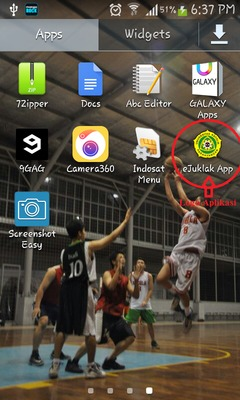

# Penjelasan Cara Menggunakan Aplikasi

Berikut adalah petunjuk penjelasan cara menggunakan aplikasi eJuklak.

1. Install eJuklak App.apk terlebih dahulu.
2. Setelah selesai, jalankan aplikasi dengan cara menekan logo aplikasi.  
  
3. Setelah program dijalankan, akan muncul tampilan awal aplikasi.
  
4. Selain melakukan *scroll* konten juklak secara langsung, aplikasi ini menyediakan fitur menu daftar isi, yang bisa anda akses dengan menekan *icon* menu daftar Isi di sudut kiri atas aplikasi, Anda dapat mengakses konten juklak sesuai dengan bab yang Anda inginkan.  
  
5. Misalkan Anda ingin membaca isi dari Bab 1 tanpa harus melakukan *scroll* terlebih dahulu dari tampilan awal, maka Anda dapat langsung menekan menu bab 1 pada bagian menu daftar isi.  
  
6. Selain daftar bab, pada menu daftar isi juga tersedia daftar subbab. Anda dapat langsung menekan bagian subbab pada daftar isi jika Anda ingin membaca juklak pada bagian subbab tertentu.
7. Anda dapat melakukan *zoom-in* dan  *zoom-out* pada konten e-Juklak. Jika  gambar atau tulisan tidak terlihat jelas pada ukuran layar normal,  Anda dapat melakukan *zoom-in* sehingga gambar atau tulisan yang dimaksud dapat Anda lihat secara jelas. Semua konten pada e-Juklak dapat Anda *zoom-in* dan *zoom-out*. Sehingga tidak perlu khawatir jika konten e-Juklak tidak dapat dengan jelas dibaca.  
  - **Gambar Standar**  
    
  - **Setelah Zoom**  
    
8. Aplikasi e-Juklak ini dapat mengikuti posisi layar ketika Anda melakukan *rotate handphone* Anda. Sehingga Anda dapat membaca e-Juklak baik dalam posisi *handphone* sedang vertical maupun horizontal. 